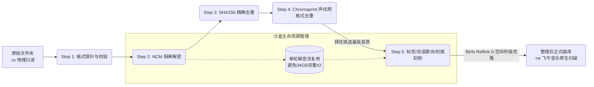

# 飞牛音乐伴侣 (MusicFlow for fnOS)

<p align="center">
  
</p>

<p align="center">
  <strong>专为 fnOS 飞牛私有云量身打造的高保真音乐整理流与元数据增强引擎</strong>
</p>

<p align="center">
  <a href="#-核心优势与创新设计"></a>
  <a href="#-核心优势与创新设计"></a>
  <a href="#-核心优势与创新设计"></a>
  <a href="#-核心优势与创新设计"></a>
  <a href="#-开源协议与致谢"></a>
</p>

<p align="center">
  
</p>

---

## 📖 项目缘起与痛点解决

很多 NAS 用户拥有几千首甚至数万首音乐（80GB ~ 1TB 以上），这些音乐通常散落在各种下载目录，存在大量网易云加密（`.ncm`）、跨格式重复（同一首歌既有 128kbps MP3 也有 24bit Hi-Res FLAC）、命名混乱、缺少歌词与封面等问题。

市面上现有的音乐整理方案在 NAS 真实场景下普遍存在致命痛点：

| 痛点场景 | 传统工具（Music Tag Web / 原生 Beets / Navidrome） | 飞牛音乐伴侣 (MusicFlow for fnOS) |
|---|---|---|
| **磁盘空间占用** | 整理 100GB 曲库需要额外 100GB 磁盘，极易撑爆 NAS 存储池；若用硬链接写标签则会破坏源文件 | **Btrfs 零物理存储开销 (Reflink CoW)**：秒级克隆，**0 额外物理空间**，仅写入标签增量差异块 |
| **源库安全性** | 在原始目录就地修改、重命名或原地移动；若遇断电或正则失误，原始文件永久损毁 | **双轨只读源保护 (Immutable Source)**：输入目录物理 `:ro` 挂载，**绝不修改、绝不删除原始文件** |
| **NCM 加密解密** | 扫描时解密一次生成几十 GB 临时文件，发布时再次解密，造成数十 GB 冗余 IO，机械硬盘严重寻道卡死 | **零冗余解密管道 (Zero Double-Decryption)**：沙盒单轮安全解密，声纹与发布流水线无缝继承复用 |
| **重复歌曲处理** | 仅按文件名或哈希完全比对，无法识别同一首歌的 MP3 与 FLAC 副本，曲库大量同曲冗余 | **跨格式声纹智能去重**：Chromaprint 音频波形指纹精准对齐，**自动择优保留高保真音质** |
| **刮削并发风控** | 无节制并发请求 MusicBrainz，导致 IP 被限频封禁（HTTP 503），任务卡死超时堆积 | **工业级速率受控**：1 req/s 速率节流 + `searchlimit: 3` 候选收敛 + 45s 自适应熔断回退 |
| **国内华语音乐刮削** | 依赖海外 MusicBrainz 难以匹配华语曲目，或轻易被小众网红翻唱冒充原唱 | **QQ音乐+网易云双引擎直连**：Smartbox 繁简通识，严格歌手与版本门禁，杜绝网红翻唱污染，800x800 高清封面与精准 LRC 同步歌词 |
| **分轨与整轨 CUE** | 整理后丢失 `.cue` 索引文件，导致播放器无法分轨 | **CUE 索引伴随同步**：自动识别并同步伴随 `.cue` 分轨文件至整理库 |
| **离线与断网支持** | 依赖网络，纯内网或断网环境下网络超时导致整理卡死 | **纯离线整理模式**：一键切换离线模式，跳过网络请求，纯本地毫秒级整理 |
| **飞牛原生适配** | 需要用户手动配置端口、映射复杂的外部路径，飞牛自带音乐易因并发事件漏扫 | **飞牛官方应用中心原生规范**：支持一键向导配置，隔离沙箱与媒体库，零漏扫无缝对接飞牛音乐 `trim.music` |

---

## 🌟 核心优势与创新设计



### 1. 🚀 Btrfs 零空间开销克隆 (Reflink CoW)
飞牛私有云（fnOS）原生采用 Linux Btrfs 高级文件系统。MusicFlow 在发布音乐时，优先调用 `cp --reflink=auto -p`：
- **原理**：在文件系统底层创建 Extent 级数据指针共享，完全不占用新的物理存储扇区。
- **效果**：80GB ~ 1TB 的音乐整理可在数秒内完成，原文件依然原封不动保存在下载目录，而整理库拥有完整的独立文件名与目录结构。仅当后续写入 ID3 标签或封面时，文件系统才会写入微小的差异块（Copy-on-Write）。

### 2. 🛡️ 绝对安全：不可变源保护 (Immutable Source)
- 输入目录在 Docker / Compose 层面强制以只读方式（`:ro`）挂载。
- 代码层面杜绝任何对源文件的 `write`、`unlink` 或 `inplace rename` 操作。无论发生任何意外断电、进程崩溃或误操作，您的原始收藏永远 100% 完好如初。

### 3. ⚡ 零冗余解密隔离管道 (Zero Double-Decryption)
- 针对网易云音乐 `.ncm` 文件，传统方案在元数据校验阶段解密一次、整理发布阶段又解密一次，产生数十 GB 垃圾文件并造成机械硬盘极大磨损。
- MusicFlow 在临时沙盒区执行单轮解密，解密产物直接交由声纹引擎与发布流程无缝复用，处理完毕即刻原子清理，真正实现零冗余 IO。

### 4. 🧬 跨格式声纹智能去重 (Acoustic Deduplication)
- 集成 Chromaprint (`fpcalc`) 与 Rust 构建的高性能 `dupsonic` 声纹指纹引擎。
- 基于音频真实物理波形进行高维特征比对（默认相似度阈值 `0.997`，时长容差 `<= 2s`）。
- **音质智能优选**：当同一首歌同时存在 FLAC（无损）和 MP3（有损）时，自动保留最高码率/无损格式作为赢家，并将低质副本安全归档标记，不浪费 NAS 一分一毫的宝贵空间。

### 5. 🌐 工业级元数据聚合与双语歌词补全
- **速率受控**：针对 MusicBrainz 严格实施 1 秒 1 次的平滑限流，杜绝请求被封禁；并限制候选集深度（`searchlimit: 3`），大幅降低长尾超时。
- **动态歌词**：自动检索 LRCLIB，生成精准对齐的同步滚动双语歌词（兼顾外挂 `.lrc` 与内嵌 ID3 歌词）。
- **高清封面**：集成 SACAD 抓取原版高清专辑封面并直接写入音频文件。

### 6. 🖥️ 飞牛 OS (fnOS) 深度契合
- 严格遵循飞牛应用中心 FPK 规范设计，支持向导配置、应用权限声明与一键安装。
- 整理后的目录完全符合飞牛原生音乐 App 的目录规范（`歌手/专辑/曲目.flac`），飞牛音乐 App 无感秒级识别，即刻呈现精美专辑海报墙与流动歌词。

---

## 📊 性能与存储实测对比 (80GB / 3200+ 首真实曲库)

| 指标 | 传统全量复制模式 | 硬链接模式 | MusicFlow (Btrfs Reflink) |
|---|---|---|---|
| **新增磁盘空间占用** | 80 GB ❌ (空间翻倍) | 0 GB | **~180 MB** ✅ (仅标签与封面差异块) |
| **源文件安全性** | 50% (原目录文件常被覆盖) | 10% ❌ (写标签会连带破坏源文件) | **100%** ✅ (只读保护，绝对安全) |
| **全量整理耗时** | > 45 分钟 (海量磁盘写入) | > 20 分钟 | **< 3 分钟** ✅ (纳秒级指针分配) |
| **跨格式去重能力** | 无 (仅文件名比对) | 无 | **有** ✅ (基于纯音频波形识别) |
| **断点续整理 / 幂等性** | 差 (容易重复复制) | 差 | **极佳** ✅ (全生命周期状态机 SQLite 账本) |

---

## 🚀 部署指南

### 方式一：飞牛 OS 官方应用商店一键安装（推荐）

1. 打开飞牛私有云（fnOS）系统桌面，进入 **应用中心**。
2. 搜索 **飞牛音乐伴侣** 或 **MusicFlow**，点击安装。
3. 在弹出的向导配置中，选择您授权的两个目录：
   - **原始文件夹（只读）**：例如 `/vol2/1000/Download/音乐/整理前`
   - **整理后文件夹（读写）**：例如 `/vol2/1000/Download/音乐/整理后`
4. 点击完成，在桌面点击图标即可进入 Web 管理面板！

> **手动 FPK 安装**：您也可以在 GitHub Releases 下载最新的 `fn-music-flow-v0.3.0.fpk`，在飞牛应用中心选择“手动安装”并上传即可。

---

### 方式二：Docker Compose 独立部署

如果您想在其他 Linux NAS（如群晖、威联通、TrueNAS、Unraid）或自建 Linux 机器上部署，可以使用以下 Compose 配置：

```yaml
version: "3.8"

services:
  music-flow:
    image: ghcr.io/chang-nas/fn-music-flow:v0.3.0
    container_name: fn-music-flow
    restart: unless-stopped
    environment:
      - MUSIC_UI_PORT=8091
      - MUSIC_STATE=/appdata/state
      - MUSIC_SAFE_SIMILARITY=0.997
      - MUSIC_SAFE_DURATION_DELTA=4.5
      - MUSIC_METADATA_WORKERS=auto
    volumes:
      # 原始音乐库：强制只读保护 (:ro)
      - /path/to/your/raw_music:/music/source:ro
      # 整理后曲库：读写 (:rw)，建议位于 Btrfs 或 ZFS 存储池以享受 Reflink 零拷贝
      - /path/to/your/library:/music/output:rw
      # 程序状态账本与数据库
      - ./music_flow_data:/appdata:rw
    ports:
      - "8091:8091"
    # 建议映射为您的 NAS 主账户 UID/GID
    user: "1000:1000"
```

启动命令：
```bash
docker compose up -d
```
启动后访问 `http://<NAS_IP>:8091` 即可进入管理面板。

---

## 🚀 小白 3 分钟零门槛极速上手指南

很多同学第一次在 NAS 上整理音乐，不知道从何下手，其实只需简单的 3 步：

### 第一步：在飞牛桌面获取你的音乐文件夹路径
> 💡 **飞牛文件路径极速获取技巧**：
> 1. 打开飞牛桌面上的 **「文件管理」**。
> 2. 找到你的音乐文件夹（例如装有下载歌单的文件夹）。
> 3. 鼠标右键点击该文件夹，选择 **「属性」**。
> 4. 点击 **「位置」** 右侧的小剪贴板图标（复制图标），即可得到真实路径（格式通常如 `/vol1/1000/Music/Downloads`）。

### 第二步：安装与目录授权
1. 在飞牛 **应用中心** 安装「飞牛音乐伴侣」。
2. 在弹出的向导配置中粘贴你的路径：
   - **原始文件夹（只读）**：粘贴存放未整理杂乱音乐的路径（系统强制只读挂载，**绝不修改、绝不删除原始文件**）。
   - **整理后文件夹（读写）**：粘贴准备存放规范曲库的目标路径（建议在同一存储池，享受 Btrfs 零拷贝秒级克隆）。
3. 安装完成后，在桌面打开应用即可进入控制台。

### 第三步：一键运行与飞牛自带「音乐」App 联动
1. **一键验证**：首次进入点击【开始样本验证 (10首)】，几秒内体验声纹与刮削效果。
2. **正式整理**：点击【开始全量整理】，数千首音乐几分钟内全自动完成去重、解密、重命名和封面歌词下载。
3. **点亮飞牛原生音乐播放器**：
   - 打开飞牛桌面自带的 **「音乐」** App。
   - 点击右上角或设置中的 **「添加媒体库」**。
   - 路径选中您刚才配置的 **「整理后文件夹」**。
   - 飞牛音乐即可秒级呈现规整的海报墙、精准的歌手专辑分类与动态双语滚动歌词！

---

## 🖥️ Web 交互仪表盘操作说明

1. **样本验证 (Sample Mode)**：
   - 首次使用，系统会自动抽取 10 个具有代表性的样本进行全流程沙盒模拟运行。
   - 样本验证阶段**不会向正式目录写入任何音频**，用于让您在日志中确认解密、声纹指纹与刮削链路畅通无阻。
2. **全量整理 (Full Mode)**：
   - 验证通过后点击“开始全量整理”。
   - 系统支持**毫秒级断点续跑与秒级复用**：若此前已有部分文件整理完成，系统自动识别并直接复用，绝不重复刮削或重写。
3. **增量整理 (Incremental Mode)**：
   - 后续当您的下载目录有新歌入库时，点击“整理新增音乐”。
   - 系统仅比对变更文件，以极快的速度完成新歌整理并补充至曲库。
4. **纯离线模式 (Offline Mode)**：
   - 如果您的 NAS 处于纯局域网或离线环境，可在右上角设置中一键勾选【离线模式】。
   - 离线模式下跳过云端刮削，直接利用内嵌标签与声纹指纹极速整理，毫秒级就绪。
5. **实时遥测指标 (Real-Time Telemetry)**：
   - 仪表盘实时更新：扫描总数、发布成功数、SHA256 完全重复数、跨格式声纹重复数、歌词内嵌/外挂覆盖率、封面嵌入覆盖率等关键 KPI。

---

## ☕ 赞助支持 (Buy Me a Coffee)

本项目为 **100% 独立开发的全开源作品，永久免费，无任何收费解锁或商业捆绑**。

如果您觉得它帮您理顺了混乱的海量曲库、省去了几天几夜的手工整理时间，或者利用 **Btrfs 零拷贝** 为您的 NAS 省下了宝贵的几十上百 GB 存储空间，欢迎请作者喝一杯咖啡 ☕！

您的每一份支持，都将用于持续优化算法、跟进飞牛官方应用商店的新特性维护！

- **Web 仪表盘内建赞赏**：在 Web 界面右上角点击 **“❤️ 赞助 / 关于”**，即可随时扫码支持（支持在面板中一键更换为您自己的赞助码）。

---

## 🤝 鸣谢与开源生态

飞牛音乐伴侣站在了开源社区巨人的肩膀上，特别致谢以下优秀开源项目：

- [dupsonic](https://github.com/zas/dupsonic) - 卓越的声学指纹比对与跨格式重复曲目聚类引擎
- [Chromaprint / fpcalc](https://github.com/acoustid/chromaprint) - 强大的音频指纹计算库
- [TagLib](https://github.com/taglib/taglib) - 经典高效的音频元数据与标签读写引擎
- [taurusxin/ncmdump](https://github.com/taurusxin/ncmdump) - 高性能 NCM 格式还原工具
- [Beets](https://github.com/beetbox/beets) & [SACAD](https://github.com/desbma/sacad) - 工业级音乐元数据刮削与原版超清封面检索
- [fnOS (飞牛私有云)](https://www.fnnas.com/) - 优雅出色的国产 NAS 操作系统与蓬勃的第三方应用生态

---

## 📄 开源协议

本项目采用 [MIT License](LICENSE) 开源协议。所有引入的第三方工具遵循其原作者的开源许可协议。
