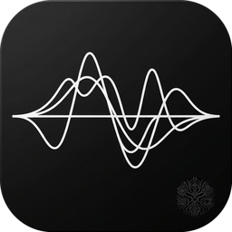
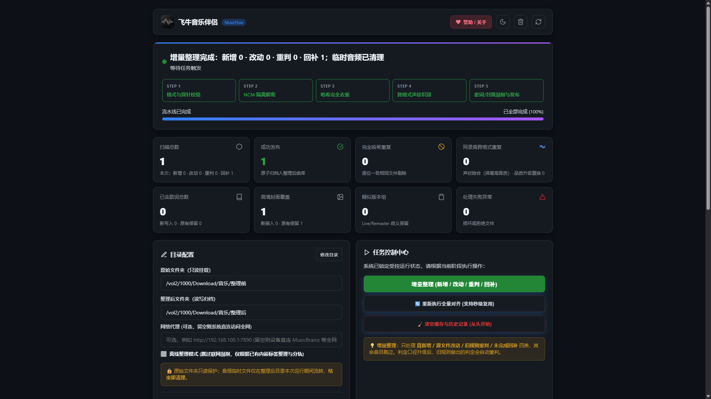

# 飞牛音乐伴侣 (MusicFlow for fnOS)

<p align="center">
  
</p>

<p align="center">
  <strong>专为 fnOS 飞牛私有云量身打造的高保真无损音乐整理与元数据增强引擎</strong>
</p>

<p align="center">
  
  
  
  
  
  
  
</p>

<p align="center">
  
</p>

---

## 📖 项目简介

很多 NAS 用户的下载目录中积累了海量音乐，常见痛点包括：
- **加密格式受限**：包含大量网易云加密（`.ncm`）格式，自带播放器无法直接播放；
- **重复冗余混乱**：同一首歌存在多个不同格式或码率的版本（如同时存在 128kbps MP3 与无损 FLAC）；
- **误匹配与翻唱伴奏污染**：由于缺乏工业级匹配算法，部分工具容易将原唱歌曲误刮削为“网络翻唱”、“伴奏带”、“Live 版”或“钢琴改编版”；
- **标签与歌词缺失**：歌曲内嵌标签缺失或繁简混杂，缺少内嵌专辑封面或双语同步歌词，WAV 格式存在标签遮蔽；
- **散乱无序**：目录层级缺乏规律，导致飞牛原生“音乐” App 难以归类和建库。

**飞牛音乐伴侣** 旨在提供一条工业级的全自动音乐整理流水线：通过声学波形特征、时长物理门禁与加权置信度评分识别同曲目，完成解密、去重、标签清洗、双语歌词合并与超清封面抓取，并以 **Btrfs 写时复制（零物理空间占用）** 输出为符合飞牛原生音乐 App 建库规范的标准目录（`歌手/专辑/曲目`）。

---

## ⚙️ 核心架构与技术亮点


### 1. 源目录物理只读保护（安全第一）
- 输入目录在容器层默认以物理只读（`:ro`）形式挂载；
- 流水线底层彻底剥离针对源文件的写、删或重命名调用，无论发生断电或误操作，原始文件依然毫发无损。

### 2. Btrfs 写时复制 (Reflink CoW 零物理占用)
- 飞牛私有云（fnOS）系统默认采用 Btrfs 文件系统。在发布曲目时，系统优先调用底层 Reflink 写时复制；
- **同卷秒级发布**：当原始目录与整理后目录位于**同一个 Btrfs 存储卷**时，底层共享物理数据块，即便整理出 100GB 曲库，**新增的物理硬盘占用几乎为 0**（仅写入标签与封面差异块）；
- **跨卷自动回退**：若两目录跨存储卷或目标盘为 ext4/NTFS，系统安全平滑回退为标准物理复制。

### 3. 工业级置信度评分引擎（彻底终结翻唱/伴奏误识）
借鉴国际知名音频整理工具 **MusicBrainz Picard** 与 **Beets** 的核心匹配算法：
- **物理时长硬门禁（Duration Guard）**：母带录音（Master Recording）在物理世界上拥有不可伪造的精确时长。任何翻唱、Live、重新演绎或伴奏，几乎不可能与原版在秒级范围内完全重合。时长偏差 $>15$ 秒执行一票否决；
- **非对称变体惩罚（Asymmetric Variant Penalty）**：原曲无变体关键词时，候选若命中“伴奏/Cover/翻唱/纯音乐/钢琴版/DJ/车载版”等词汇，**直接扣罚 50 分**；
- **70.0 分严格门禁**：结合时长、歌名与歌手多维加权评分，严格设立录取线，杜绝“错识与漏识反复横跳”。

### 4. 飞牛音乐原生生态深度适配
- **WAV/RIFF 格式标签深度清洗**：针对 WAV 格式自动清除掩盖 ID3v2 的旧 RIFF INFO 垃圾信息块，解决飞牛音乐 App 和 ffmpeg 无法识别 WAV 标签的行业顽疾；
- **伴随 CUE 自动发布与重写**：整轨抓轨文件伴随的 `.cue` 分轨索引文件自动同步发布，并自动修正内部 `FILE` 路径指向；
- **同步双语歌词智能合并**：抓取原版歌词与翻译歌词，毫秒级对齐生成原汁原味的双语同步流动歌词（`.lrc`）；WAV 等格式自动生成同名外挂歌词文件；
- **品质升级置换**：新整理的高音质无损文件（FLAC）自动置换库中历史有损副本（MP3），旧文件自动移入 `.music-archive/` 安全备份，避免曲库产生 `(2)` 副本污染。

### 5. 跨格式声纹波形指纹排重
- 基于开源 Chromaprint (`fpcalc`) 提取音频波形物理特征指纹；
- 在时长相近、声纹吻合的同录音曲目组中，按文件质量规则（FLAC > WAV > MP3 320k > 低码率）智能择优。

### 6. 全场景移动端自适应设计 (Mobile Responsive)
- 控制台前端经过深度移动端（手机 / 平板 / 飞牛手机 App 内嵌 WebView / 微信）响应式重构；
- 小屏视口（$\le 680$px）下导航栏自动转为精致纯图标布局、整理进度步进器自适应横排列表、指标卡片双列自适应；
- 按钮触控区域均达 42px+ 标准高度，表单输入框 16px 彻底杜绝 iOS 聚焦放大移位；
- 弹窗支持底部全宽抽屉式展开与横向平滑 Tab 滑动，单手交互丝滑流畅。

---

## 🚀 部署与使用指南

### 方式一：飞牛 NAS 应用中心 FPK 安装（最推荐）

1. 在项目 GitHub 仓库的 [Releases 页面](https://github.com/liuchangchxy/fn-music-companion/releases) 下载最新的 `fn-music-rebuild.fpk` 文件；
2. 打开飞牛私有云（fnOS）桌面，进入 **应用中心**；
3. 点击应用中心界面右上角的 **手动安装**，选择下载好的 `.fpk` 文件上传；
4. 在安装向导中选择授权的两个文件夹：
   - **原始文件夹（只读）**：存放未整理音乐的文件夹（例如 `/vol1/1000/Downloads/Music`）；
   - **整理后文件夹（读写）**：存放整理后标准曲库的文件夹（建议与原始目录在同一存储卷以启用 Reflink 零拷贝）；
5. 安装完成后，在飞牛桌面直接点击“飞牛音乐伴侣”图标即可进入嵌入式微应用控制台！

---

### 方式二：Docker Compose 独立部署

如果您在其他 Linux 系统或自建 NAS 上运行，可直接使用官方 Docker 镜像编排：

```yaml
version: "3.8"

services:
  music-companion:
    image: changchxy/fn-music-companion:1.0.0
    container_name: fn-music-companion
    restart: unless-stopped
    environment:
      - MUSIC_UI_PORT=8091
      - MUSIC_STATE=/appdata/v6-state
    volumes:
      # 原始音乐库：只读保护 (:ro)
      - /path/to/your/raw_music:/music/source:ro
      # 整理后曲库：读写 (:rw)
      - /path/to/your/library:/music/output:rw
      # 程序状态账本与配置
      - ./music_flow_data:/appdata:rw
    ports:
      - "8091:8091"
    user: "1000:1000"
```

启动命令：
```bash
docker compose up -d
```
启动后在浏览器访问 `http://<NAS_IP>:8091` 即可进入管理面板。

---

## 🖥️ 控制台操作流程

1. **样本验证 (Sample Mode)**：
   - 首次使用点击【开始样本验证】；
   - 系统自动在内存沙盒中对 10 首样本进行格式校验、NCM 解密与多源刮削模拟，**不向目标目录写入任何文件**，便于在终端日志确认网络与元数据匹配效果。
2. **全量整理 (Full Mode)**：
   - 验证无误后点击【开始全量整理】；
   - 流水线通过 SQLite 状态账本逐首处理，支持断点续整与秒级复用，已完成的文件自动跳过。
3. **增量整理 (Incremental Mode)**：
   - 后续有新歌曲下载入库时，点击【整理新增音乐】；
   - 仅针对新增、修改或此前失败的曲目做秒级补充。
4. **清空缓存与从头开始 (Reset)**：
   - 支持按需重置历史记录与统计指标、清空曲目状态清单与门禁、或彻底清空本地歌词/封面知识库。
5. **纯离线整理模式**：
   - 若 NAS 处于局域网断网环境，可开启【离线整理模式】，跳过外网网络请求，仅凭本地已有内嵌标签快速建库。

---

## 📦 飞牛官方应用商店上线情况说明

飞牛私有云（fnOS）采用官方审核准入机制。本项目当前的上架准备情况如下：

- [x] **官方 FPK 打包规范 100% 达标**：严格遵循飞牛应用中心规范封装（包含 `manifest`、`wizard/config`、`wizard/install`、`wizard/uninstall`、`micro_app` 桌面集成配置与高分辨率图标）。
- [x] **真实 NAS 实机测试通过**：已在真实飞牛 NAS 物理机上完成安装向导、目录权限挂载、桌面图标启动、Web 控制台联动与卸载清理的全流程回归测试。
- [x] **公共镜像就绪**：Docker Hub 镜像 `changchxy/fn-music-companion:1.0.0` 和 `latest` 已全面推送完毕，国内拉取通畅。
- [x] **开源仓库就绪**：完整源码与全套 85 项自动化单元测试已同步至 GitHub 仓库并全绿通过。
- 🚀 **官方应用中心上线进展**：
  - 目前用户已经可以随时通过飞牛 **“应用中心” -> “手动安装”** 导入 `fn-music-rebuild.fpk` 体验完整的原生应用能力；
  - 开发者已准备就绪官方上架申请材料，提交飞牛官方团队审核通过后，即可直接在飞牛应用中心“一键搜索安装”！

---

## ☕ 赞助与支持

本项目为 100% 独立开源作品，永久免费。如果飞牛音乐伴侣帮您理顺了庞大混乱的曲库、或者利用 Btrfs 零拷贝帮您省下了宝贵的 NAS 硬盘空间，欢迎在控制台的“☕ 赞助打赏”面板中请作者喝一杯咖啡，鼓励更多功能迭代！

---

## 🤝 鸣谢与开源生态

- [MusicBrainz Picard](https://picard.musicbrainz.org/) & [Beets](https://github.com/beetbox/beets) - 工业级音频元数据匹配与置信度算法启发
- [Chromaprint / fpcalc](https://github.com/acoustid/chromaprint) - 声学指纹抽取算法库
- [dupsonic](https://github.com/zas/dupsonic) - 音频声纹聚类引擎
- [taurusxin/ncmdump](https://github.com/taurusxin/ncmdump) - NCM 格式高保真还原算法参考
- [TagLib](https://taglib.org/) & [MediaFile](https://github.com/beetbox/mediafile) - 音频标签处理底层构件
- [fnOS (飞牛私有云)](https://www.fnnas.com/) - 国产优质 NAS 操作系统与应用生态

---

## 📄 开源协议

本项目采用 [MIT License](LICENSE) 开源协议。
